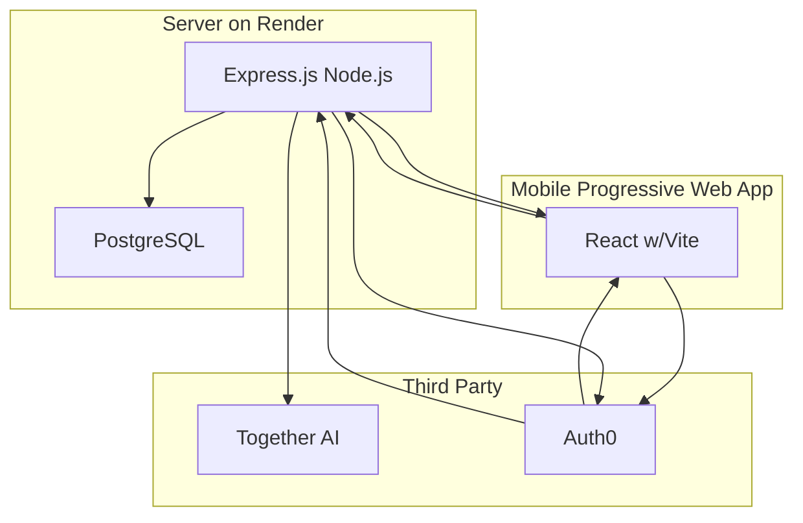

# Emotional Regulation Journal

## Goal

Enable users to track their thoughts in a journal and derive insights based on journal entries.

## Users

* Therapists - use it as a tool to recommend to their clients to track their thoughts
* People interested in mental health - use it to track their thoughts most days

# Tech Stack

## Diagram

## Details
### Server

#### Render
Hosting service for running Express.js Node.js & PostgreSQL

#### Express.js Node.js
Controller that handles incoming API requests:
* Get journaling entries for a logged in user
* Add a journal entry for a logged in user
* Import journal entries for a logged in user
* Get recommendations based on journal entries for a logged in user
* Login for specific user
* Logout for specific user
* Integrates with PostgreSQL for journaling CRUD operations

#### PostgreSQL
Database for managing journal entries (date, title, markdown) by user