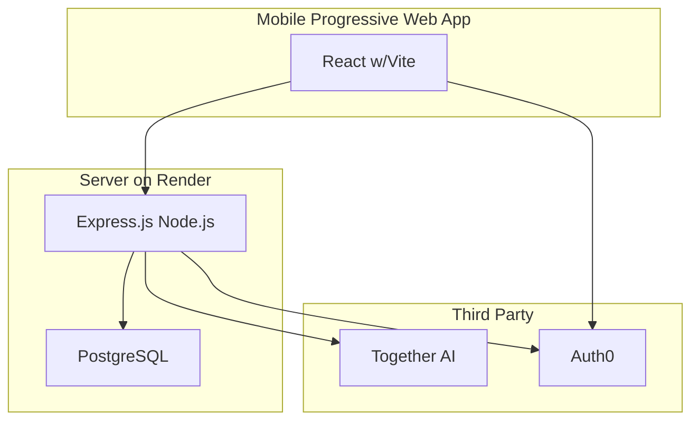
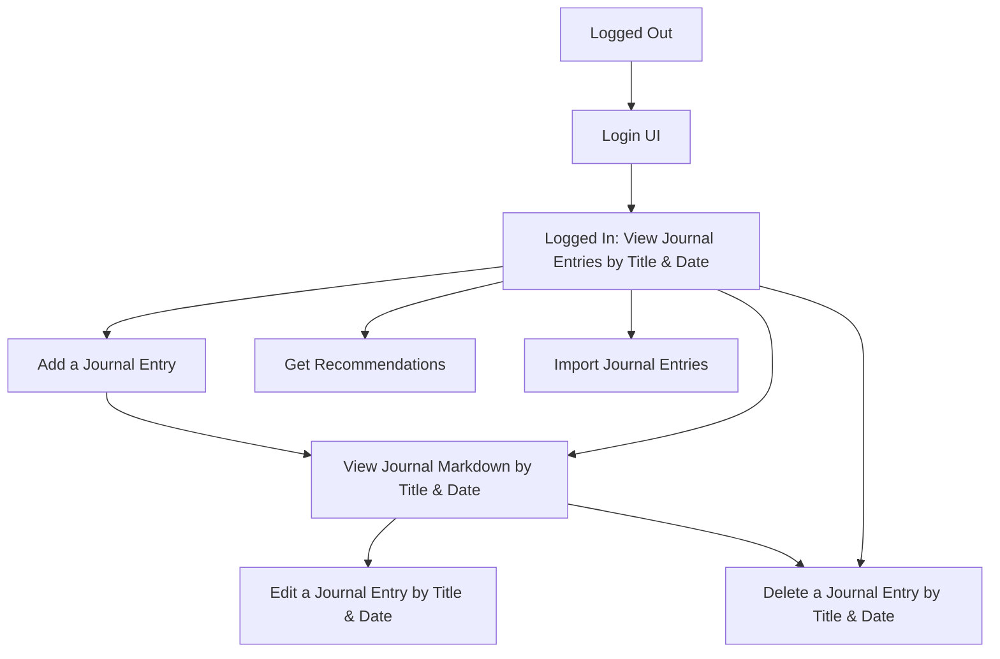

# Emotional Regulation Journal

## Goal

Enable users to track their thoughts in a journal and derive insights based on journal entries.

## Users

* Therapists - use it as a tool to recommend to their clients to track their thoughts
* People interested in mental health - use it to track their thoughts most days

# Tech Stack

## Diagram

## Details
### Server

#### Render
Hosting service for running Express.js Node.js & PostgreSQL

#### Express.js Node.js
Controller that handles incoming API requests:
* Get journaling entries for a logged in user
* Add a journal entry for a logged in user
* Edit a journal entry for a logged in user
* Delete a journal entry for a logged in user
* Import journal entries for a logged in user
* Get recommendations based on journal entries for a logged in user
* Login for specific user
* Logout for specific user
* Integrates with PostgreSQL for journaling CRUD operations

##### Risks
* Batch importing journal entries will need to handle many journal entries (load)
* Making GET requests for users with many journal entries
* Ensuring users can only access their journal entries, not someone else's
* Hitting the token limit for recommendations based on existing journal entries
* Markdown could have embedded scripts, so will need to sanitize it (e.g. sanitize-html)
* Imported md files could be large enough to cause a DOS attack (need to limit file size)
* Hitting an API rate limit when integrating with a 3rd party service (Together AI, Auth0)
    * If API rate limits are hit with Together AI or Auth0, the app will implement basic retry logic with exponential backoff to manage these limits gracefully
* Sending data over HTTP won't be secure - will mitigate via using HTTPS
    * All API requests between the client and server will be secured using HTTPS via Render’s SSL/TLS configuration
* Logging of user sensitive data doesn't provide security - will ensure no logging of user sensitive data happens

#### PostgreSQL
Database for managing journal entries by user
* A user can have zero or more journal entries
* A journal entry contains a date, title, and markdown text
    * The title & markdown text will be encrypted to allow users to feel safe that their journaling entries are private
    * Encryption will use AES-256 for securing journal titles and markdown text, with keys securely managed via environment variables

### Client

### Mobile Progressive Web App (PWA)

An installable, mobile-optimized Progressive Web App (PWA) with offline capabilities and a native app-like user experience.

#### React w/Vite

Renders UI that enables the user to do the following:
* Login as a specific user
* Logout as a specific user
* View journal entry dates & titles for a logged in user
* View journal entry markdown (via markdown-it) with date & title for a logged in user
* Edit an existing journal entry's markdown, date, and/or title for a logged in user
* Delete an existing journal entry for a logged in user
* Import journal entries for a logged in user
* Get recommendations for a logged in user using existing journaling entries

#### User Flow

##### Details
* Logged Out - initial experience when loading the app and haven't logged in previously. Allows user to login.
* Login UI - Auth0-based UI that allows the user to authenticate
* Logged In - allows user to view journal entries with title & date showing.
    * Can select a title to view journal entry
    * Can initiate adding a journal entry
    * Can delete a journal entry by title
    * Can get recommendations based on journal entries
    * Can initiate import of journal entries
    * Can logout
* View journal entry - allows user to view a journal entry's markdown, title, and date
    * Can select to edit the journal entry
    * Can choose delete the journal entry
    * Can return back to view journal entries with title & date showing
* Edit journal entry - allows user to edit journal entry's title, markdown, and date and save it. After saving, the user is returned to the view journal markdown UI.
* Delete journal entry - allows user to remove a journal entry & confirm the decision. After that, the user is returned to view journal entries by date & title.
* Add a journal entry - allows user to add a journal entry with title, date, and markdown text. After saving, the user is sent to view the journal entry that was just created.
* Get Recommendations - allows user to learn about journaling patterns based on a date range of journal entries. A user can return back to view journal entries by date & title in this UX as well. 
* Import journal entries - allows user to import one or more journal entries in .md format. After upload is complete, the user is sent to view journal entries with title & date showing.

##### Stretch Goals
* Expand Get Recommendations to support different analysis types:
    * Allows user to request recommendations on what to do based on a date range of journal entries
    * Allows user to request sentiment trends based on a date range of journal entries
* Expand Import journal entries to support direct import from Notion's API

### Third Party

#### Auth0

Third-party service for managing client-side and server-side authentication.

https://auth0.com/

#### Together AI

Third-party service that allows for integrating with hosted AI models (e.g. Llama) to process text.

https://docs.together.ai/docs/nextjs-chat-quickstart

## Project Milestones

### 1. Deployed Single User HTTP Journaling App
Can view, add, edit, and delete journal entries deployed on Render.

### 2. Deployed Multi-User HTTP Journaling App
* Add login / logout behavior via Auth0
* Can view, add, edit, and delete journal entries by logged in user deployed on Render

### 3. Deployed Multi-User HTTPS Journaling App with encrypted & sanitized journal entries
* Support HTTPS via a signed certificate on Render & client & server calls
* Encrypted journal titles & markdown text via AES-256 and environment variables
* Sanitize markdown text to ensure embedded scripts cannot be executed