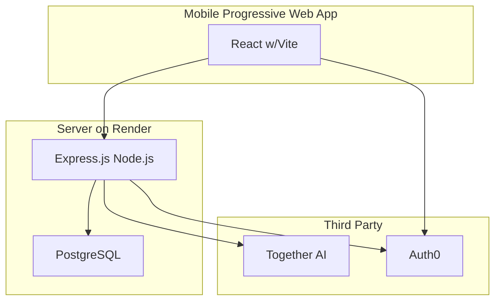

# Emotional Regulation Journal

## Goal

Enable users to track their thoughts in a journal and derive insights based on journal entries.

## Users

* Therapists - use it as a tool to recommend to their clients to track their thoughts
* People interested in mental health - use it to track their thoughts most days

# Tech Stack

## Diagram

## Details
### Server

#### Render
Hosting service for running Express.js Node.js & PostgreSQL

#### Express.js Node.js
Controller that handles incoming API requests:
* Get journaling entries for a logged in user
* Add a journal entry for a logged in user
* Edit a journal entry for a logged in user
* Delete a journal entry for a logged in user
* Import journal entries for a logged in user
* Get recommendations based on journal entries for a logged in user
* Login for specific user
* Logout for specific user
* Integrates with PostgreSQL for journaling CRUD operations

#### PostgreSQL
Database for managing journal entries (date, title, markdown) by user

### Client: React w/Vite

Renders UI that enables the user to do the following:
* Login as a specific user
* Logout as a specific user
* View journal entry dates & titles for a logged in user
* View journal entry markdown (via markdown-it) with date & title for a logged in user
* Edit an existing journal entry's markdown, date, and/or title for a logged in user
* Delete an existing journal entry for a logged in user
* Import journal entries for a logged in user
* Get recommendations for a logged in user using existing journaling entries

### Third Party

#### Auth0

Third-party service for managing client-side and server-side authentication.

https://auth0.com/

#### Together AI

Third-party service that allows for integrating with hosted AI models (e.g. Llama) to process text.

https://docs.together.ai/docs/nextjs-chat-quickstart

